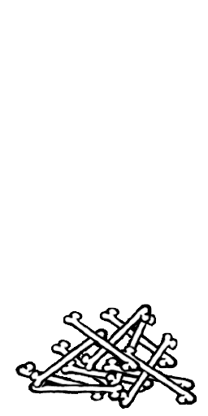
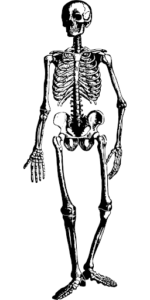
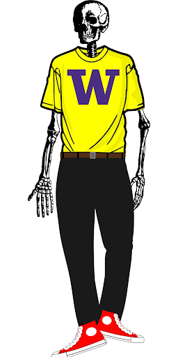
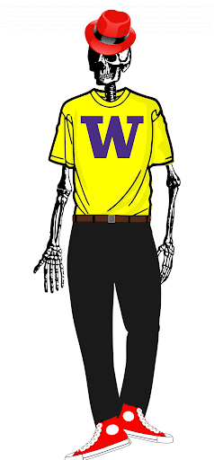

<!--
author:   Andrea Charão

email:    andrea@inf.ufsm.br

version:  0.0.1

language: PT-BR

narrator: Brazilian Portuguese Female

comment:  Material de apoio para a disciplina
          ELC1090 - Desenvolvimento de Software para Web
          da Universidade Federal de Santa Maria

translation: English  translations/English.md
-->

<!--
liascript-devserver --input README.md --port 3001 --live
https://liascript.github.io/course/?https://raw.githubusercontent.com/AndreaInfUFSM/elc1090-2023a/master/classes/02/README.md
-->


# Primeiro projeto

> Objetivo: Criar site estático para atender colega-cliente

Cliente

- define demanda de site estático (landing page, portfolio, documentação, informativo, etc.)
- fornece conteúdo
- pode ser externo à turma? até pode, mas provavelmente inviável no prazo

Recursos

- Básico: HTML, CSS
- Design: Templates, templates, templates! Exemplo: https://templatemag.com/bootstrap-templates/
- Opcionais: Bootstrap, geradores de sites estáticos
- Proibido: plataformas no-code (Wix, Google Sites, etc.), CMS (Wordpress, Joomla, etc.)


# Static Websites

Web site é software?

[(sim)] Sim
[(nao)] Não


                 {{1}}
************************************************

- O que é exatamente um "site estático"?
- Segundo Wikipedia: https://en.wikipedia.org/wiki/Static_web_page
- Outras definições:

  - https://www.w3schools.com/howto/howto_website_static.asp
  - https://www.sanity.io/static-websites

************************************************  


## Usos


- Páginas pessoais
- Portfolios pessoais ou corporativos
- Landing pages
- Sites de documentação
- Brochure sites

## Desenvolvimento

Básico:

- conteúdo
- criação

  - estrutura; código HTML
  - estilo: código CSS
- hospedagem/publicação/deploy


### Criação

- Editar manualmente HTML, CSS (pouco produtivo, mas vale fazer algumas vezes na vida)
- Aproveitar frameworks facilitadores, por exemplo:

  - Bootstrap: https://getbootstrap.com/ https://www.w3schools.com/bootstrap/
  - Tailwind: https://tailwindcss.com/ 
  - Ver: https://ritza.co/articles/tailwind-css-vs-bootstrap-vs-material-ui-vs-styled-components-vs-bulma-vs-sass/
- Static site generators: https://jamstack.org/generators/ 
- Abordagem moderna: JAMStack: JavaScript, API, Markup (para quem já sabe o básico)
- Para quem trabalha na área, vale olhar: https://www.netlify.com/blog/complete-guide-to-headless-cms/

### Hospedagem

Muitas opções de hospedagem gratuita:

- GitHub Pages
  - Exemplos: https://gsajulia.github.io/  https://lorenzofman.github.io/
- Vercel
- Render
- Netlify
- Repl.it
- Muitos outros...

Na inf.ufsm.br:

- Entrar com seu usuário em ssh.inf.ufsm.br 
- Copiar arquivos para a pasta public_html
- Exemplo: http://www-usr.inf.ufsm.br/~rtrindade/
- Atualmente: https://br.linkedin.com/in/rafael-gauna-trindade


## Cases


A seguir, alguns exemplos com características de sites estáticos (nem todos são realmente estáticos)

Começaremos por sites profissionais **santamarienses** e no final alguns cases aleatórios pelo mundo afora

                 {{1}}
************************************************

**Saúde**

Será que são sites estáticos?

- https://iortsm.com.br/
- https://www.icardio.com.br/
- https://www.clinicamedspa.com.br/
- https://alcidesvogel.com.br/
- https://andraandrearechia.com.br/

************************************************


                 {{2}}
************************************************

**Agro**

Será que são sites estáticos?

- https://irrigaglobal.com/br/
- https://cowmed.com.br/
- https://www.drakkar.com.br/
- https://agrimec.com.br/

************************************************


                 {{3}}
************************************************

**Comunicação e marketing**

Será que são sites estáticos?

- https://www.finish.com.br
- https://toca.cc/
- https://wp8.com.br/
- https://ouseweb.com.br/
- https://www.flync.com.br/
- https://criapolis.com.br/


************************************************


                 {{4}}
************************************************
**Engenharia e Arquitetura**

Será que são sites estáticos?

- https://www.construtorajobim.com.br/
- https://dbgraus.com.br
- https://www.lineastudio.com.br/


************************************************


                 {{5}}
************************************************
**Organizações**

Será que são sites estáticos?

- https://www.geoparquequartacolonia.com.br/
- https://www.hotelitaimbe.com.br/
- https://www.cdlsm.com.br/


************************************************


                 {{6}}
************************************************

**Outros**

Será que são sites estáticos?

- https://www.nytimes.com/interactive/projects/well/workouts/
- https://survey.stackoverflow.co/2022/
- https://alvarotrigo.com/blog/web-developer-portfolio-examples/


************************************************


# Web Basics

Para começar, uma analogia!

Simplificando, podemos resumir a Web em 4 itens: 

1 Conteúdo...
 

2 Estrutura...


3 Estilo...
 

4 Comportamento...


## Protocolo HTTP

Falando mais tecnicamente... 

Web é uma aplicação de protocolos de rede e de linguagens


Arquitetura cliente-servidor 

- Conceito de sistemas distribuídos (antes da Web)
- Classicamente, browser é cliente (user-agent) que faz requisições aos servidores
- Protocolo HTTP (HyperText Transfer Protocol) define regras para esta interação


Mais animadamente:


Fonte: https://dev.to/lydiahallie/cs-visualized-cors-5b8h


Mais sobre HTTP em: 

- Mozilla. An overview of HTTP. https://developer.mozilla.org/en-US/docs/Web/HTTP/Overview
- Barry Pollard. HTTP/2 in Action. https://www.amazon.com/dp/1617295167?tag=uuid10-20&asin=1617295167&revisionId=&format=4&depth=1

### URL

- Requisições HTTP acessam **recursos** na web
- Uniform Resource Locator (URL) identifica recursos na web 
- Geralmente, quando falamos de "endereço web", estamos nos referindo a uma URL
- Principais elementos na escrita de URLs (sintaxe):


Mais sobre isso em: https://developer.mozilla.org/en-US/docs/Web/HTTP/Basics_of_HTTP/Identifying_resources_on_the_Web

### Requisições/respostas

Mensagens HTTP que trafegam pela rede são requisições ou respostas.

Exemplo de requisição enviada pelo cliente:


Exemplo de resposta do servidor:


Mais sobre isso em: https://developer.mozilla.org/en-US/docs/Web/HTTP/Messages


## Browser

Navegadores modernos são quase um "sistema operacional" :-)

Este tutorial aprofundado (Inside look at modern web browser) começa explicando threads e processos:

- Part 1: https://developer.chrome.com/blog/inside-browser-part1/
- Part 2: https://developer.chrome.com/blog/inside-browser-part2/
- Part 3: https://developer.chrome.com/blog/inside-browser-part3/
- Part 4: https://developer.chrome.com/blog/inside-browser-part4/


Exemplo de ilustração: The main thread parsing HTML and building a DOM tree


## HTML

- Hypertext Markup Language (HTML)
- Descreve conteúdo + estrutura de uma página web
- Usa *tags* para estruturar o conteúdo (início e fim) 

Exemplo (HTML5):

```html
<!DOCTYPE html>
<html>
  <head>
    information about the page
  </head>
  <body>
    <header>
      <!-- Header of the webpage body (e.g. logo, navigation bar) -->
    </header>
    <main>
      <!-- Main section of the webpage body (where most content is) -->
      <p>This is a paragraph</p>
    </main>
    <footer>
      <!-- Footer of the webpage body (e.g. copyright info) -->
    </footer>
  </body>
</html>
```


Mais em:


- https://developer.mozilla.org/en-US/docs/Learn/HTML/Introduction_to_HTML/Getting_started
- https://developer.mozilla.org/en-US/docs/Learn/HTML/Introduction_to_HTML/Document_and_website_structure
- https://developer.mozilla.org/en-US/docs/Web/HTML/Element
- https://developer.mozilla.org/en-US/docs/Learn/HTML/Howto
- https://www.w3schools.com/html/

## CSS

- Cascading Style Sheets (CSS)
- Descreve a aparência e o layout de uma página web (complementando HTML, que descreve o conteúdo/estrutura)
- Especificações: https://www.w3.org/Style/CSS/specs.en.html
- Código em arquivo .css referenciado no .html

                 {{1}}
************************************************
Link no HTML

Exemplo no `<head>`:

```html
<head>
  ...
  <link rel="stylesheet" href="https://maxcdn.bootstrapcdn.com/bootstrap/3.4.1/css/bootstrap.min.css">
  ...
</head>  
```
************************************************


                 {{2}}
************************************************
Rules = selectors + properties


- Arquivo CSS = uma ou mais regras (rules)
- Básico: rules = selectors + properties

  - Selector: quais elementos da página devem ser estilizados (https://developer.mozilla.org/en-US/docs/Web/CSS/Reference#selectors)
  - Property: estilos que serão aplicados aos elementos
- Cada property tem um conjunto de valores possíveis
- Muuuitas propriedades: https://developer.mozilla.org/en-US/docs/Web/CSS/Reference

Forma geral:

```css
  selectors-list {
    properties-list
  }
```

Exemplo:

```css
  strong {
    color: red;
  }
```

- `strong`: seletor
- `color`: propriedade
- `red`: valor da propriedade

Outro exemplo:


Mais em:

- https://developer.mozilla.org/en-US/docs/Learn/Getting_started_with_the_web/CSS_basics
- https://developer.mozilla.org/en-US/docs/Learn/CSS/Howto
- https://www.w3schools.com/css/default.asp


************************************************

# Produções 

> A seguir... Produções da turma neste desafio: projetos e dicas compartilhadas.

## Adicione

> Clique abaixo para criar seu repositório de entrega:

https://classroom.github.com/a/tbkNUqfY

> Preencha este formulário para adicionar seu projeto na lista:


<form id="form5">
      <label for="developer">Seu nome:</label><br>
      <input class="lia-input lia-quiz__input" name="developer" type="text" required> <br>
      <label for="client">Cliente:</label><br>
      <input class="lia-input lia-quiz__input" name="client" type="text" placeholder="Nome de colega..." required> <br>
      <label for="project">Nome do projeto:</label><br>
      <input class="lia-input lia-quiz__input" name="project" type="text" placeholder="Por exemplo: Portfolio pessoal, Landing page, etc..." required> <br>
      <label for="tech">Tecnologias escolhidas:</label><br>
      <input class="lia-input lia-quiz__input" name="tech" type="text" placeholder="HTML, CSS, Bootstrap, templates, etc." required> <br>
      <label for="github">Repositório de entrega no GitHub:</label><br>
      <input class="lia-input lia-quiz__input" name="github" type="text" placeholder="Crie seu repositório no link acima antes de preencher" required> <br>
      <label for="deploy">Plataforma de hospedagem escolhida:</label><br>
      <input class="lia-input lia-quiz__input" name="deploy" placeholder="Indique a que mais interessa ou deixe em branco caso não saiba ainda" type="text"> <br>

      <button class="lia-btn lia-btn--outline" type="submit">Submit</button>
   </form>
   <script>
      (function () {
         form5.addEventListener('submit', function (e) {
            // Prevent default behavior
            e.preventDefault();
            // Create new FormData object
            const formData = new FormData(form5);
            // Convert formData object to URL-encoded string
            const payload = new URLSearchParams(formData);
            // Post the payload using Fetch
            send.lia("Adicionando...", false)
            //send.lia("Adicionando...", [], false)
            fetch("https://script.google.com/macros/s/AKfycbzVnYewBduUclZlt6uchNsxQI-kOhGvX8QGvoQQCf9tfWtdNxgRQkX9YquXjMszf763LQ/exec?action=postProject1&" + payload)
               .then((response) => response.json())
               .then((json) => send.lia(json.message, false))         
            // const payload = new URLSearchParams(formData);
            // // Post the payload using Fetch
            // fetch('https://script.google.com/macros/s/AKfycbzVnYewBduUclZlt6uchNsxQI-kOhGvX8QGvoQQCf9tfWtdNxgRQkX9YquXjMszf763LQ/exec?action=postSite&url=" + payload)
            //    .then(res => res.json())
            //    .then((json) => send.lia(json.message, [], false))
         })
      })()
   </script>

## Em andamento

> Lista de projetos em andamento (seja paciente, a carga pode demorar alguns segundos)

 <script>
    let mylist = ''
    fetch('https://script.google.com/macros/s/AKfycbzVnYewBduUclZlt6uchNsxQI-kOhGvX8QGvoQQCf9tfWtdNxgRQkX9YquXjMszf763LQ/exec?action=getProjects1')
      .then(response => response.json())
      .then(data => data.objects.forEach(project => { 
        mylist += "- " + "**Developer: " + `${project.developer}` + "**\n\n" + 
                  "  " + "Cliente: " + `${project.client}` + "\n\n" + 
                  "  " + "Projeto: " + `${project.project}` + "\n\n" +
                  "  " + "Tecnologias: " + `${project.tech}` + "\n\n" +
                  "  " + "Repositório: " + `${project.github}` + "\n\n" +
                  "  " + "Hospedagem: " + `${project.deploy}` + "\n\n"
        send.liascript(mylist) // this shouldn't be here
        }))        
    
    "Loading..."
</script>

## Dev Dicas

> Edite este arquivo no GitHub: https://github.com/AndreaInfUFSM/elc1090-2023a/blob/master/classes/02/README.md (linguagem: Markdown)

> Adicione dicas, crie um pull request e conquiste **pontos de participação**!

- Nome:
- Dica:
- Link:
