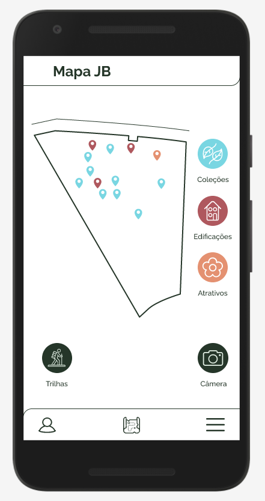

<!--
author:   Andrea Charão

email:    andrea@inf.ufsm.br

version:  0.0.1

language: PT-BR

narrator: Brazilian Portuguese Female

comment:  Material de apoio para a disciplina
          ELC1090 - Desenvolvimento de Software para Web
          da Universidade Federal de Santa Maria

translation: English  translations/English.md
-->

<!--
liascript-devserver --input README.md --port 3001 --live
https://liascript.github.io/course/?https://raw.githubusercontent.com/AndreaInfUFSM/elc1090-2023a/master/classes/jbsm/README.md
-->

# Jardim Botânico da UFSM

<iframe class="embedly-embed" frameborder="0" scrolling="no" allowfullscreen src="https://cdn.embedly.com/widgets/media.html?src=https://www.relive.cc/view/vRO78RNWrK6/widget?r=embed-site&url=https://www.relive.cc/view/vRO78RNWrK6?r=embed-site&image=https://www.relive.cc/view/vRO78RNWrK6/png?x-ref=embed-site&key=f1631a41cb254ca5b035dc5747a5bd75&type=text/html&schema=relive" width="1024" height="801" style="position: absolute;top: 0;left: 0;width: 100%;height: 100%;"></iframe>

## Site

Institucional: https://www.ufsm.br/orgaos-suplementares/jardim-botanico

??

## Projeto de app 

Criado em 2020 (Lab Interfaces Desenho Industrial)

?? ??

### Briefing

- **O quê?** Aplicativo do estilo "Descubra o Jardim Botânico" - guia para visitantes

- **Para quem?** Público visitante

- **Como?** Oferecendo um mapa com as principais atrações (plantas carnívoras, plantas tóxicas, plantas exóticas, plantas nativas, trilhas, etc.), links de informações, horários, programações, agendamento de visitas, avaliação da visita.

- **Por quê?** Visitantes chegam no Jardim Botânico e nem sempre têm um monitor à disposição. Com o aplicativo, as visitas podem ser autoguiadas

### Projeto de interface

Figma: https://www.figma.com/proto/2VoTxVanN5sBdJ6lv8jNQS/JB-UFSM-%5BAPP%5D-%5Bmodo-claro%5D?node-id=1-3&starting-point-node-id=117%3A0

## Revisão

Temos requisitos mantidos, alterados, adicionados...

> Muito espaço para criatividade e contribuições!

### Requisitos mantidos

- Pontos de interesse filtráveis no mapa
- Páginas informativas (visitas, contato, localização, etc.)
- Menus
- Trilhas

### Alterações/remoções

- ~App nativo~ => web app
- Mapa com OpenStreetMaps, custom markers
- Sem autenticação / perfil de usuário, mas com localstorage
  
  - Funcionamento offline
  - Armazenar visitados para uso na filtragem ?

- Câmera:

  - Atalho para postagem em rede social?
  - Leitura de QR Code (ver adiante)

- Mural substituído por leitura de redes sociais

### Adições

- Busca (texto livre)
- Leitura de QR Code para acesso a página interna / externa
- Manutenção de conteúdo em planilhas Google Sheets

  - Textos descritivos, contatos, horários, POIs 

- Imagens no Google Drive (!?)
- Internacionalização

